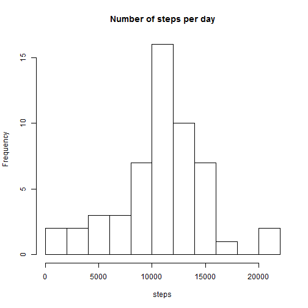
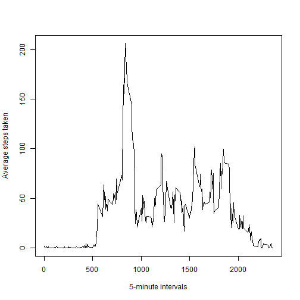
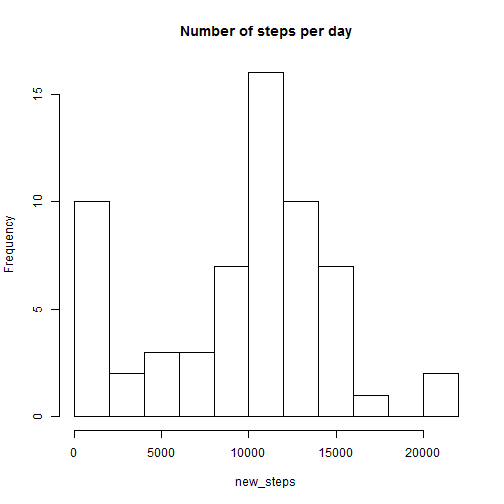
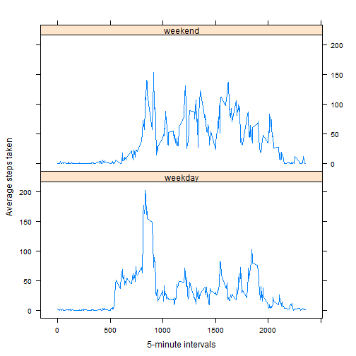

#Introduction

This is an R Markdown document for an assigment in Reproducible Research course on Coursera by Jouni Huopana. R code below provides answers to the questions presented in the assignment.

###Loading data
Data is loaded into R from the provided CSV file.

```r
data <- read.csv("activity.csv")
data$date<-as.Date(data$date)
head(data)
```

```
##   steps       date interval
## 1    NA 2012-10-01        0
## 2    NA 2012-10-01        5
## 3    NA 2012-10-01       10
## 4    NA 2012-10-01       15
## 5    NA 2012-10-01       20
## 6    NA 2012-10-01       25
```
You might need to set the locales to English to handle the dates correctly

```r
Sys.setlocale("LC_ALL","English")
```

```
## [1] "LC_COLLATE=English_United States.1252;LC_CTYPE=English_United States.1252;LC_MONETARY=English_United States.1252;LC_NUMERIC=C;LC_TIME=English_United States.1252"
```
###What is mean total number of steps taken per day?

To handle provided dates as separate, *unique* is used to separate unique dates.

```r
days<-unique(data$date)
```
Then the number of steps is extracted from the data corresponding to individual days.

```r
steps <- integer(0)
for(i in 1:length(days)){
  steps[i]<-sum(data$steps[data$date==days[i]])
}
```
Histogram shows the number of steps.

```r
hist(steps, breaks=15, main="Number of steps per day")
```

 
Mean and meadian is calculated

```r
mean(steps, na.rm=TRUE)
```

```
## [1] 10766.19
```

```r
median(steps, na.rm=TRUE)
```

```
## [1] 10765
```
Unique minute intervals are extracted from the data

```r
x_interval<-unique(data$interval)
```
And a mean is calculated for each interval

```r
y_mean <- numeric(0)
for(i in 1:length(x_interval)){
  y_mean[i]<-mean(data$steps[data$interval==x_interval[i]], na.rm=TRUE)
}
```
###What is the average daily activity pattern?
Average step count is the plotted for the intervals.

```r
plot(x_interval,y_mean,type="l",xlab="5-minute intervals", ylab="Average steps taken")
```

 

###Inputing missing values
Numbers of rows with NAs is calculated

```r
nonas<-sum(complete.cases(data)==FALSE)
```
New data is created and NAs are replaced by rounded mean value for each interval

```r
new_data<-data
for(i in 1:nrow(data)){
  if(anyNA(new_data[i,])){
    new_data$steps[i] <- round(y_mean[new_data$interval[1]==x_interval])
  }
}
```
###Are there differences in activity patterns between weekdays and weekends?
Calculating new mean and median values.


```r
new_steps <- integer(0)
for(i in 1:length(days)){
  new_steps[i]<-sum(new_data$steps[new_data$date==days[i]])
}
```

Plotting the new histogram.

```r
hist(new_steps, breaks=15, main="Number of steps per day")
```

 

The mean and median have gone down from the earlier results. This due to increase in small values.


```r
mean(new_steps, na.rm=TRUE)
```

```
## [1] 9429.77
```

```r
median(new_steps, na.rm=TRUE)
```

```
## [1] 10395
```

###Are there differences in activity patterns between weekdays and weekends?
Adding new column to the data.


```r
new_data$weekday <- weekdays(new_data$date)
```

Creating a weekend/weekday column.


```r
sun<-new_data$weekday == "Sunday"
sat<-new_data$weekday == "Saturday"
weekend <- sat | sun
new_data$week <- weekdays(new_data$date)
new_data$week[weekend]<-"weekend"
new_data$week[weekend==FALSE]<-"weekday"
```

Creating a new data set that has mean values for each interval for both weekday and weekend factors.  

```r
mean_week    <- tapply(new_data$steps[weekend==FALSE], new_data$interval[weekend==FALSE], mean)
mean_weekend <- tapply(new_data$steps[weekend==TRUE], new_data$interval[weekend==TRUE], mean)

weekData <- data.frame(interval = c(unique(new_data$interval),unique(new_data$interval)),
                       steps    = as.vector(c(mean_week,mean_weekend)),
                       weekend  = c(rep("weekday",length(unique(new_data$interval))),
                                    rep("weekend",length(unique(new_data$interval)))))
head(weekData)
```

```
##   interval     steps weekend
## 1        0 2.2888889 weekday
## 2        5 0.6666667 weekday
## 3       10 0.4222222 weekday
## 4       15 0.4444444 weekday
## 5       20 0.3555556 weekday
## 6       25 1.5777778 weekday
```

Plotting the panel plot to show differens in average steps taken during weekdays and weekend.


```r
library("lattice")
xyplot(steps ~ interval | weekend, data = weekData,layout = c(1, 2),type='l',xlab="5-minute intervals", ylab="Average steps taken")
```

 
